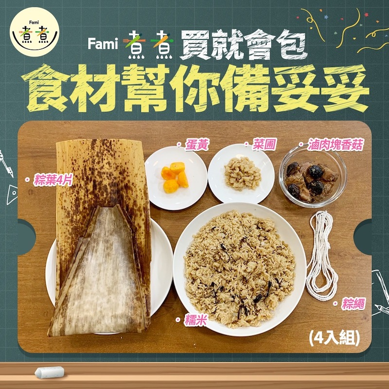
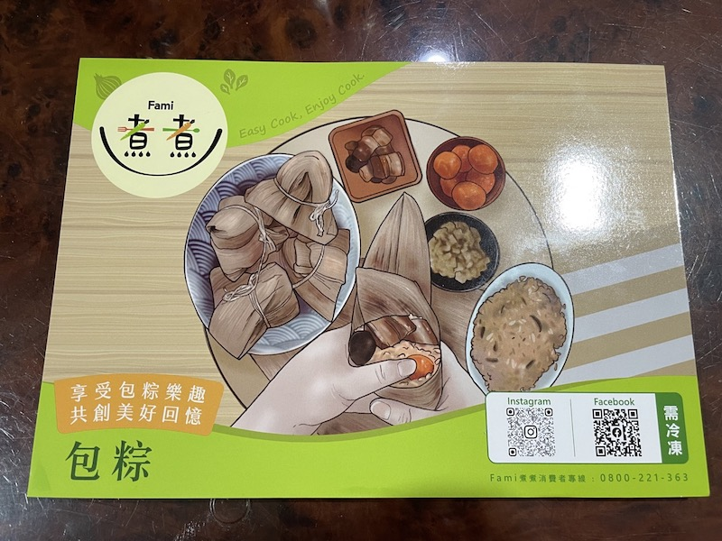
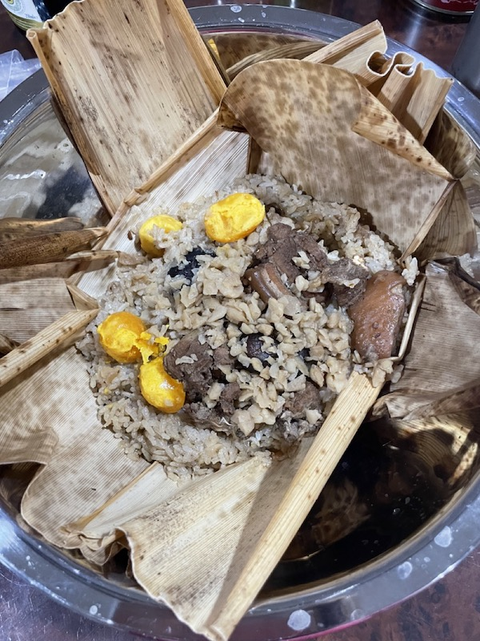

我家附近的全家偶爾會在群組內辦活動，我感覺自己還蠻常獲獎的，上次抽到砂糖橘這次抽到 Fami 煮煮的粽子🤣 

不知道是不是把運氣都用在全家了所以才一直沒有中樂透（欸）

<!--more-->

全家店長貼的內容物

看起來很方便的樣子，料都幫你準備好了，只需要按照教學把粽子包起來再拿去蒸就可以了。想著週末姪子姪女們回來可以一起玩，結果因為吃的東西太多實在是不想碰粽子最後還是暫時讓它在冰箱多呆幾天。

結果昨天午餐我在餐桌上看到它了。

我想像中它應該是長這個樣子。

結果桌上擺的是這個樣子。

me be like：？？？？？？？？？？？

抱歉我沒想過我媽的創意料理可以一再地讓我歎為觀止（之前還曾把我的韓式炸醬泡麵煮成湯的，還嫌不好吃，我問號！）

而且我媽還有點小得意（？）地跟我說他粽葉下面墊著上面蓋著一起拿去蒸，這樣跟包起來的意思也一樣，都會有粽葉香。

我想全家應該沒想過送給我會得到這種結果吧🤣

至於食後心得，料有點少，蛋黃倒是還不錯，雖然是冷凍的但沒有腥味，應該原本處理得不錯。香菇就是香菇（廢話），肉的部分肥瘦參半吧，我不喜歡吃肥肉，而且我有吃到有點硬的軟骨（不太確定那還算不算是軟骨總之是我無法咬碎吃下去的🤣），糯米是粒粒分明的那種，不會很黏稠，但味道有點淡。

整體而言我覺得是 DIY 意義大於好吃吧XD

我覺得這世界上的粽子就沒有比我阿嬤包的還好吃的了🥲 端午節快來（欸）

